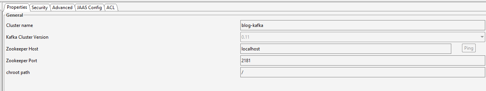
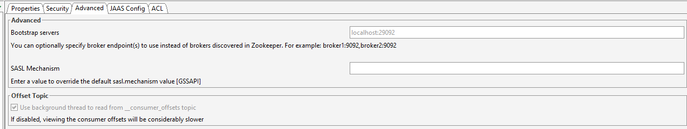

## Description
POC app of the Spring Cloud microservices architecture written built with DDD and hexagonal architecture.

### Services

- configuration-service - Spring Cloud Config server
- discovery-service - Spring Eureka server
- gateway-service - Initially build with Spring Cloud Gateway (test Zuul Netflix as well)
- user-service - User management service
- post-service - Post management service
- comment-service - Comments of posts with likes

### Spring Cloud and other cloud components

- Eureka - service registration
- Spring Config
- Sleuth - tracing system
- Zipkin - to analyze traces (possibility to user Kafka as a source of traces)
- Kafka with Zookeeper - message broker
- Feign - declarative HTTP client
- Resilience4j - centralized circuit breaker placed in the Gateway App. Currently, used on client side in feign client
- Sonar - code analysis
- Kafka - message broker, events channel
- Micrometer - metrics exporter for Spring Boot
- Prometheus - gathers app metrics taken from Spring Boot Actuator
- Grafana - metrics dashboards
- elasticsearch - model indexing and open text search

## Configuration

### Requirements

- App should be built and run in Java 11
- Docker and Kubernetes

### Custom modules port mapping

|Module|Ports|
|------|-----|
|Spring Cloud Config server|8888|
|Eureka server|8761|
|Gateway service|8080|
|Simulation service|8099|
|User services|8100 - 8199|
|Post services|8200 - 8299|
|Comment services|8300 - 8399|

### External modules (docker)

|Module| Ports |
|------|-------|
|Sonar| 9100  |
|Zipkin server| 9411  |
|Kafka| 29092 |
|Prometheus| 9090  |
|Grafana| 9091  |

### Profiles

- dev - localhost dev platform without Docker
- mock - local platform with Docker compose
- k8s - kubernetes environment

### Run sonar analysis

- start sonar container. Default user/pass: admin/admin
- Run maven command:

```
mvn verify sonar:sonar -Dsonar.host.url=http://localhost:9000
```

`verify` step is needed to get sonar-project.properties file by maven plugin

### Zipkin

Zipkin gathers traces of communication between services. <br />
For K8S environment Zipkin uses HTTP communication: http://localhost:9411. <br />
For dev and mock profiles, apps and Zipkin uses Kafka topic `zipkin` to gather traces. Kafka has to be started in docker
compose.

### Kafka

Offset Explorer can be connected to the Kafka cluster run in docker compose with the following way: </br>
 <br />


### Monitoring

Monitoring consists of:

- Micrometer - facade exporter required to push metrics to the prometheus server from Spring Boot app. Configured in
  Maven.
- Prometheus - system monitoring server run in docker: http://localhost:9090
- Grafana - presentation layer http://localhost:3000 Prometheus data source is defined in the initial config.

## Build and run

### Build mvn project

```
mvn clean package
```

### build docker images

Run script <br />

```
.\build_images.sh
```

or use spring boot plugin for maven (the latest image version is set by default): <br />

```
clean package spring-boot:build-image -DskipTests
```

<b> WARNING: images built with spring boot have problems in kubernetes - memory issue</b>

### Docker compose environment

```
\docker\blog.yml
```

Docker compose environment components:

- business components: comment-service, post-service, user-service, simulation-service, gateway-service
- configuration-service - Spring config server
- discovery-service - Spring Eureka
- infrastructure components:
    - Kafka
    - Zipkin
    - Prometheus
    - Grafana

### Kubernetes environment

Go to `/k8s/blog/` where build scripts are defined and run commands: <br />

```
kubectl apply -f zipkin-service.yaml
kubectl apply -f user-service.yaml
kubectl apply -f post-service.yaml
kubectl apply -f gateway-service.yaml
kubectl apply -f comment-service.yaml
kubectl apply -f simulation-service.yaml
```

Standard K8S service registry and config (ConfigMap and Secrets) are used.


## Business requirements - User stories
### User
- User registration: As a user, I want to be able to register user.
- Blacklisting: As a user, I want to be able to block user to not let him comment or like my posts and like my comments.
- Remove from blacklist:  As a user, I want to be able to unblock previously blocked user.

### Post
- Search posts with open text: As a user, I want to be able to search posts with free text, CQRS needed
- Add post - validate user in user-service, add post, send event
- Edit post - validate user in user-service, check post, send event
- Like post - validate user in user-service, validate blacklist, send event
- Remove like from post - validate user in user-service, send event

### Comment actions
- Comment post - validate user in user-service, validate blacklist, validate post, send event
- Like comment - validate user in user-service, validate blacklist, validate post, send event 
- Dislike comment - validate user in user-service, validate blacklist, validate post, send event

## Code organization
### DDD
DDD shall be used here based on that: https://wkrzywiec.medium.com/ports-adapters-architecture-on-example-19cab9e93be7 and book.
Use ports and adapters (application, core without frameworks, infrastructure as connectors and ports implementation)

### Ports and adapters packages
- `*.application` - input interfaces like: REST API controllers, event listeners, schedulers
  - `.controller` - REST controllers
  - `.scheduler` - schedulers
  - `.listener` - external event listeners
  - `.service` - application services/facades with transactions integrates all application components. They contain only flow of use cases and all the business logic is performed in domain port. 
      Cache also should be here. Should use only incoming ports on a domian.
- `*.core` - core domain package, should contain only clean Java code without frameworks and operates on domain objects (ports, commands) without implementation.
  - `.model` - domain model: aggregates and value objects. Business logic in the scope of one aggregate should be in the aggregate.  
    - `.command` - command objects used in incoming ports
    - `.event` - domain events
    - `.exception` - exceptions
  - `.port.incoming` - interfaces describing ports incoming to the domain model. Ports are gathered in the Facade or domain service.
  - `.port.outgoing` - interfaces describing outgoing ports used by domain service (facade)
  - `.service` - it contains two types of services:
    - domain services - for business actions which do not fit in any aggregate
    - domain facade of the inbound ports implementation. Still operates on the domain objects only.
- `*.infrastructure` - infrastructure is technology/framework related part of the app. Adapters (ports implementations) and beans config.
  - `.adapter` - adapters - ports implementations
  - `.config` - configuration of the adapter beans. All dependencies should be injected here to not infect domain part.

## TODO
- jak zwracać asynchroniczną odpowiedź z sagi przez kontroler
- Spring Reactor
- Spring Cloud Schema Registry
- Spring Cloud Commons
- Spring Cloud Vault
- Spring Cloud Stream

